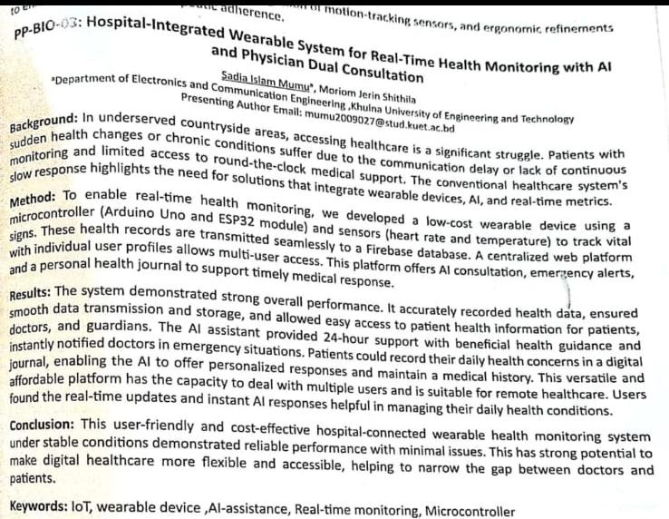

# AI Health Monitoring System

## 🏆 Achievement
Selected for poster presentation at International Biotechnology Conference 2025 (BRAC University)

## 📄 Abstract
This project presents a wearable IoT-based system for real-time health monitoring using Arduino, ESP32, and sensors. Health data is transmitted to a Firebase cloud database and analyzed using AI to provide real-time insights, emergency alerts, and personalized recommendations.

## 🖼️ Poster

## ⚙️ Technologies
Arduino, ESP32, Firebase, IoT, AI
